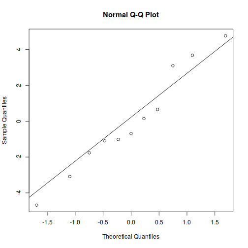

# Linear Regression
## Get Data
We first copy the built-in `mtcars` dataset and subset it


```r
df <- mtcars |> subset(cyl == 4, select = c("mpg", "wt", "qsec"))
knitr::kable(df)
```


|               |  mpg|    wt|  qsec|
|:--------------|----:|-----:|-----:|
|Datsun 710     | 22.8| 2.320| 18.61|
|Merc 240D      | 24.4| 3.190| 20.00|
|Merc 230       | 22.8| 3.150| 22.90|
|Fiat 128       | 32.4| 2.200| 19.47|
|Honda Civic    | 30.4| 1.615| 18.52|
|Toyota Corolla | 33.9| 1.835| 19.90|
|Toyota Corona  | 21.5| 2.465| 20.01|
|Fiat X1-9      | 27.3| 1.935| 18.90|
|Porsche 914-2  | 26.0| 2.140| 16.70|
|Lotus Europa   | 30.4| 1.513| 16.90|
|Volvo 142E     | 21.4| 2.780| 18.60|

## Analysis
We then use `lm()` to perform the linear regression analysis.
The dot (`.`) symbol in the formula argument is used here to select all
columns as the independent variables. In this case it's just `wt` and `qsec`.


```r
model <- lm(mpg ~ ., df)
summary(model)
```

```
## 
## Call:
## lm(formula = mpg ~ ., data = df)
## 
## Residuals:
##     Min      1Q  Median      3Q     Max 
## -4.6810 -1.4301 -0.6919  1.8748  4.7627 
## 
## Coefficients:
##             Estimate Std. Error t value Pr(>|t|)  
## (Intercept)  24.8843    12.4287   2.002   0.0802 .
## wt           -7.5136     2.3291  -3.226   0.0121 *
## qsec          0.9904     0.7885   1.256   0.2445  
## ---
## Signif. codes:  0 '***' 0.001 '**' 0.01 '*' 0.05 '.' 0.1 ' ' 1
## 
## Residual standard error: 3.23 on 8 degrees of freedom
## Multiple R-squared:  0.5896,	Adjusted R-squared:  0.487 
## F-statistic: 5.746 on 2 and 8 DF,  p-value: 0.02837
```

It is important to check if the regression model is valid.
We will compare the model residuals to a theoretical normal distribution


```r
qqnorm(residuals(model))
qqline(residuals(model))
```



